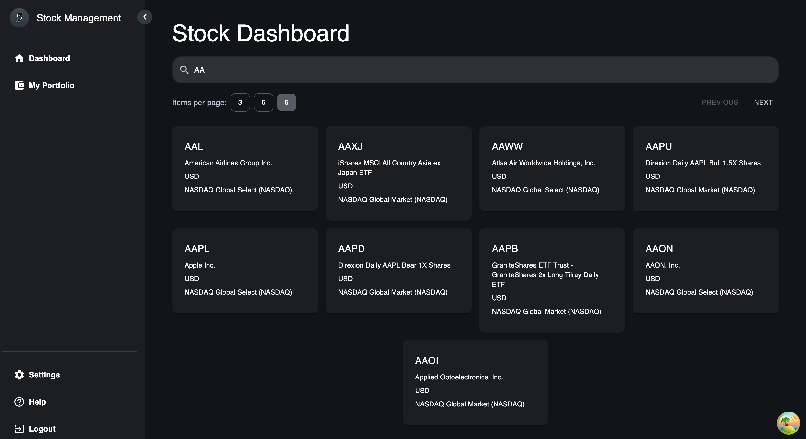
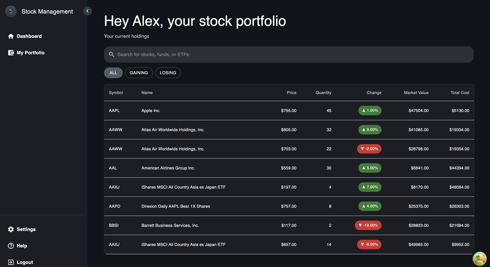
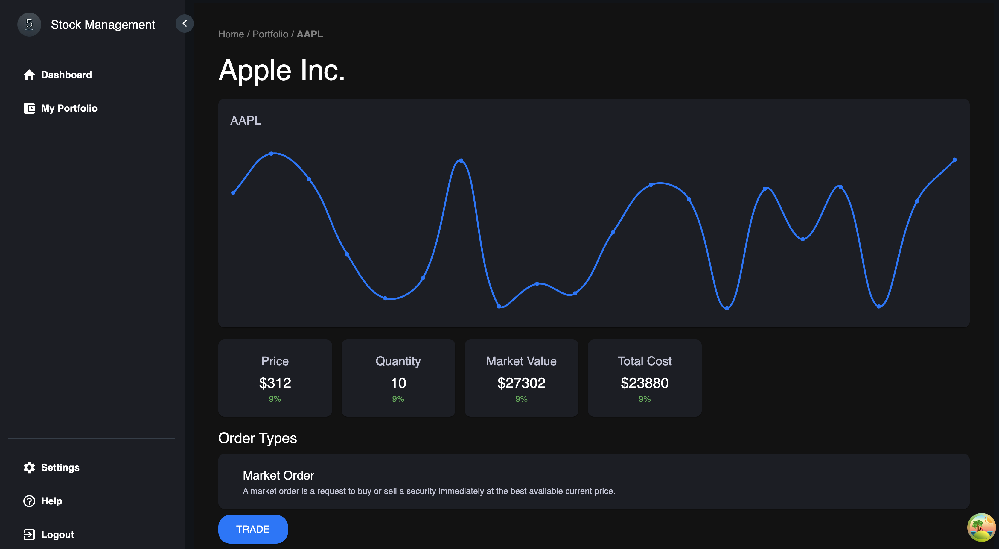

# The5ers Stock Management Website

## Overview

This project is a comprehensive stock management web application that enables users to manage their stock portfolios and view detailed stock information. Users can add, view, and edit their portfolio, search for stocks, and view the latest stock data with a user-friendly interface.

The application consists of a frontend built with React and MobX for state management, and a backend using NestJS and MongoDB. The backend provides a REST API to handle stock data, while the frontend consumes this data to present a beautiful and intuitive user experience.

## Features

- **Stock Search and Filter:** Search for stocks, funds, or ETFs using the stock symbol or name.
- **Portfolio Management:** Add and remove stocks from the user's portfolio.
- **Stock Details:** View detailed stock information, including real-time data and visual charts.
- **Pagination and Sorting:** Easily navigate through stock listings with pagination and sorting.
- **Responsive Design:** The application is fully responsive and optimized for both desktop and mobile devices.

## Prerequisites

- **Node.js** and **npm**: Make sure you have Node.js and npm installed. You can download them from [nodejs.org](https://nodejs.org/).
- **MongoDB**: Ensure you have MongoDB installed and running. You can use Docker or install it locally. For Docker:
  ```bash
  docker run -d -p 27017:27017 --name mongodb mongo
  ```
## Installation

- **Clone the Repository**:
   ```bash
   git clone https://github.com/yourusername/the5ers.git
   cd the5ers
   ```
- **Install Dependencies**: From the root directory, install dependencies for both frontend and backend:
   ```bash
   npm install
   cd client && npm install
   cd ../server && npm install
   ```
- **Environment Setup**: Create .env files in both the client and server directories with the necessary environment variables:

   **Server** `.env`

   ```bash
   MONGODB_URI=mongodb://localhost:27017
   MONGODB_DB=stockdb
   MONGODB_USER=your_username
   MONGODB_PASS=your_password
   ```

   **Client** `.env`

   ```bash
   VITE_STOCK_API_KEY=your_stock_api_key
   VITE_STOCK_API_URL=https://financialmodelingprep.com/api/v3
   VITE_BASE_URL=http://localhost:3000
   ```

- **Run the Application**: From the root directory, use the following command to start both the frontend and backend:  

   ```bash
   npm start
   ```
## Usage

- **Visit the Main Home Page**: Open your browser and navigate to http://localhost:5173. You will see the stock dashboard with search and filter options.

- **Manage Your Portfolio**: Click on any stock to view detailed information. Use the "Add to Portfolio" button to add the stock to your portfolio.

- **Run MongoDB**: Make sure your MongoDB server is running. If using Docker, you can start it with:

   ```bash
      docker start mongodb
   ```

## Screenshots
   - Dashboard Page
   

   - Stock Details Page
   

   - Portfolio Management
   

## API Details
The backend provides a REST API to manage stock data. Here are some key endpoints:

- `GET /api/v1/stocks`: Get a list of all stocks.
- `GET /api/v1/stocks/:symbol`: Get detailed information for a specific stock.
- `POST /api/v1/stocks/add`: Add a stock to the user's portfolio.

## Project Structure
   ``` ruby
   .
   ├── client                  # Frontend application (React, MobX)
   │   ├── src
   │   │   ├── components      # Reusable UI components
   │   │   ├── hooks           # Custom hooks
   │   │   ├── pages           # Pages (Dashboard, Stock Details, etc.)
   │   │   └── services        # API service calls
   │   └── public              # Public assets (index.html, images, etc.)
   ├── server                  # Backend application (NestJS, MongoDB)
   │   ├── src
   │   │   ├── stocks          # Stocks module (controller, service, schema)
   │   │   ├── database        # Database configuration
   │   │   └── app.module.ts   # Main app module
   └── .env                    # Environment variables
```

